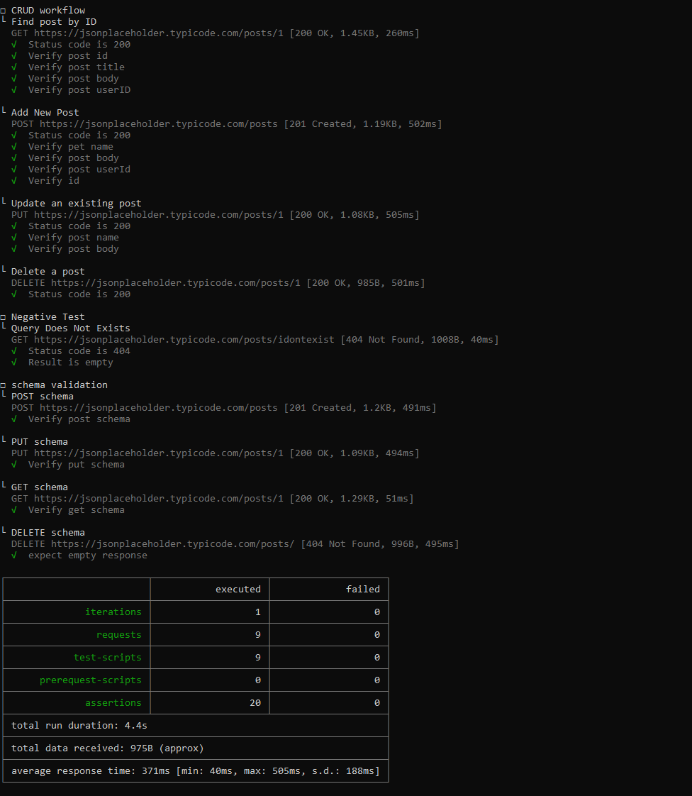

# postman-api-testing
API endpoint testing using Postman. Includes CRUD testing and Schema validation.
The test are structured in the following way

```
.
├── CRUD workflow                   # To test the basic CRUD function
├── Negative Test                   # to test bad request
└── Schema Test                     # to test api json format
```


## To run the test locally
```bash
npm install -g newman
```
```bash
newman run .\postman\Postman-API-Test-Suite.postman_collection.json -e .\postman\jsonplaceholder-env.postman_environment.json
```




## Devops test Pipeline (CircleCI)

In order to use CircleCI , an account is required. You can sign in via Github, which makes it easier to add your projects from your repos.

More information about getting started with CircleCI, can be found [here](https://circleci.com/docs/2.0/first-steps/#section=getting-started).

### How does it work with CircleCI

Below is the  `.circleci/config.yml` file. This is using the `Postman` Orb to run the collection file.

> Orbs are packages of config that you can use to quickly get started with the CircleCI platform. Orbs enable you to share,
> standardize, and simplify config across your projects. You may also want to use orbs as a reference for config best
> practices. Refer to the CircleCI Orbs Registry for the complete list of available orbs.

This is one of the  basic `config.yml` file. There several other Newman specific options available, just like when running `Newman` from the CLI. More information about the options can be found [here](https://circleci.com/orbs/registry/orb/postman/newman).

```yml
version: 2.1
orbs:
  newman: postman/newman@0.0.2
jobs:
  build:
    executor: newman/postman-newman-docker
    steps:
      - checkout
      - newman/newman-run:
          collection: ./postsman/Postman-API-Test-Suite.postman_collection.json
          environment: ./postman/jsonplaceholder-env.postman_environment.json
```
